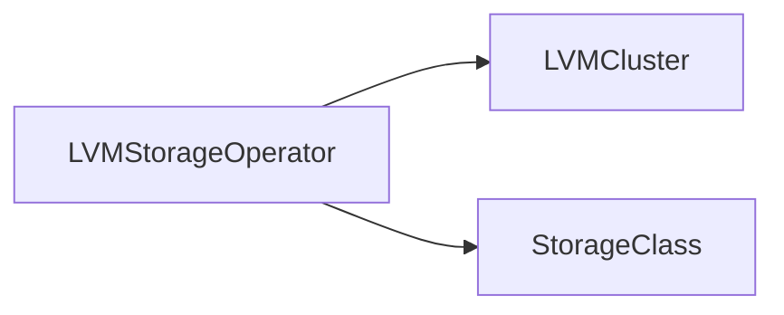
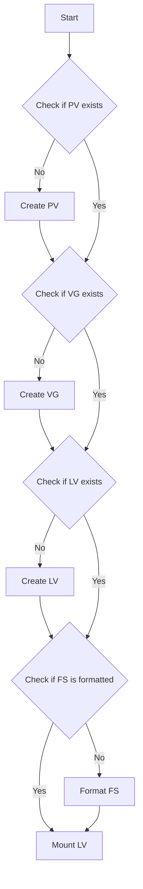

# Logical Volume Manager
Logical Volume Manager (LVM) is a software-based tool used for managing disk storage in Linux operating systems, including RHEL. LVM works by abstracting physical storage devices, such as hard disk drives or solid-state drives, into logical volumes that can be resized, moved, and backed up without disrupting the operation of the system.

In RHEL, LVM is implemented as a set of kernel modules that provide support for logical volumes. When LVM is installed, it creates a new layer of abstraction between physical storage devices and the file system. This layer is composed of three main components: physical volumes (PVs), volume groups (VGs), and logical volumes (LVs).

Physical volumes (PV) are storage devices that are managed by LVM. They can be disks, partitions, or even entire storage arrays. When a physical volume is initialized by LVM, it is divided into a number of physical extents (PEs), which are small, fixed-size units of storage.

Volume groups (VG) are collections of one or more physical volumes that are grouped together by LVM. A volume group provides a pool of storage space that can be allocated to logical volumes as needed.

Logical volumes (LV) are virtual disks that are created within volume groups. A logical volume is composed of one or more physical extents, which can be allocated from one or more physical volumes. Logical volumes can be resized dynamically, which means that administrators can add or remove storage capacity without having to shut down or restart the system.

LVM in RHEL provides several advantages over traditional partition-based storage systems. First, LVM allows administrators to allocate storage space more efficiently, by allowing logical volumes to span multiple physical volumes. Second, LVM provides greater flexibility in managing storage resources, by allowing logical volumes to be resized on-the-fly without disrupting the system. Finally, LVM provides enhanced reliability, by providing built-in support for backups and snapshots of logical volumes.

LVM is a powerful tool for managing disk storage in RHEL, providing flexibility, scalability, and reliability to meet the storage needs of modern enterprise applications.

[Source](https://access.redhat.com/documentation/en-us/red_hat_enterprise_linux/7/html/logical_volume_manager_administration/lvm_definition)

# About The LVM Storage Operator

In Openshift, the LVM operator (LVMS) provides a way to manage and automate the creation, deletion, resizing, and backup of logical volumes in an Openshift cluster.

Some of the key features of the LVM operator include:

- Automation: The Local Volume Manager Storage (LVMS) operator automates the process of creating and managing logical volumes, reducing the need for manual intervention and making it easier to scale storage resources in an Openshift cluster.

- Dynamic resizing: The LVMS operator enables dynamic resizing of logical volumes, which means that administrators can easily add or remove storage capacity as needed without having to shut down or restart applications.

- Backup and recovery: The LVMS operator includes built-in backup and recovery capabilities, which means that administrators can easily create and restore backups of logical volumes in the event of data loss or corruption.

- Integration with other Openshift components: The LVM operator is designed to work seamlessly with other components of the Openshift platform, such as persistent volumes and storage classes, to provide a comprehensive storage management solution.

- Customization: The LVMS operator can be customized to meet specific storage requirements, allowing administrators to define policies and rules for logical volume creation and management.

Overall, the LVMS operator is a powerful tool for managing storage resources in an Openshift cluster, providing automation, scalability, and flexibility to meet the needs of modern containerized applications.

# Limitations of the LVM Operator
- **Currently, it is not possible to upgrade from OpenShift Data Foundation Logical Volume Manager Operator 4.11 to LVM Storage 4.12 on single-node OpenShift clusters.** See: [1](https://docs.openshift.com/container-platform/4.12/storage/persistent_storage/persistent_storage_local/persistent-storage-using-lvms.html#lvms-upgrading-lvms-on-sno_logical-volume-manager-storage)
- The LVMS is only supported in single node Openshift clusters deployed by Red Hat Advanced Cluster Management (RHACM).
- You can only create a single instance of the LVMCluster custom resource (CR) on an OpenShift Container Platform cluster.
- You can make only a single deviceClass entry in the LVMCluster CR.
- When a device becomes part of the LVMCluster CR, it cannot be removed.
- LVM Storage creates a volume group using all the available unused disks and creates a single thin pool with a size of 90% of the volume group. The remaining 10% of the volume group is left free to enable data recovery by expanding the thin pool when required.
- LVM Storage configures a default overprovisioning limit of 10 to take advantage of the thin-provisioning feature. The total size of the volumes and volume snapshots that can be created on the single-node OpenShift clusters is 10 times the size of the thin pool.

[Source](https://docs.openshift.com/container-platform/4.12/storage/persistent_storage/persistent_storage_local/persistent-storage-using-lvms.html#lvms-preface-sno-ran_logical-volume-manager-storage)

# Installation of the LVMS Operator
You can install the LVMS Operator using either the [Web Console](https://docs.openshift.com/container-platform/4.12/storage/persistent_storage/persistent_storage_local/persistent-storage-using-lvms.html#lvms-installing-lvms-with-web-console_logical-volume-manager-storage)  or via [RHACM](https://docs.openshift.com/container-platform/4.12/storage/persistent_storage/persistent_storage_local/persistent-storage-using-lvms.html#lvms-installing-odf-logical-volume-manager-operator-using-rhacm_logical-volume-manager-storage).

# The LVMCluster custom resource
The `LVMCluster` custom resource is a Kubernetes custom resource that is used in the LVMS Operator on OpenShift. The LVMCluster custom resource is used to create a Logical Volume Manager (LVM) cluster after LVM Storage is installed on OpenShift Container Platform.

Here are the steps to create an LVMCluster custom resource:

    1. Ensure that the Project selected is `openshift-storage`.
    2. In the OpenShift Container Platform Web Console, click `Operators` → `Installed Operators` to view all the installed Operators.
    3. Click on `LVM Storage`, and then click `Create LVMCluster` under `LVMCluster`.
    4. In the `Create LVMCluster` page, select either `Form view` or `YAML view`.
    5. In the `YAML view`, specify the LVMCluster custom resource definition with the required fields such as name, deviceClasses, thinPoolConfig, and nodeSelector.

[Source](https://docs.openshift.com/container-platform/4.12/storage/persistent_storage/persistent_storage_local/persistent-storage-using-lvms.html#lvms-creating-lvms-cluster_logical-volume-manager-storage)

The LVMCluster custom resource has the following fields:

    - `name`: The name of the LVMCluster custom resource.
    - `deviceClasses`: A list of device classes that define the storage devices to use in the LVM cluster.
    - `thinPoolConfig`: The configuration for the thin pool that will be created in the LVM cluster.
    - `nodeSelector`: A node selector that matches the worker nodes to use in the LVM cluster.

The LVMCluster custom resource also has some optional fields:

    - `tolerations`: A list of node tolerations to apply to the LVMCluster custom resource.
    - `deviceSelector`: A device selector that selects the storage devices to use in the LVM cluster. If this field is not included during the LVMCluster creation, it is not possible to add the deviceSelector section to the CR. In this case, the LVMCluster needs to be removed and a new CR needs to be created.
    
# How can you provision storage using LVMS?
You can provision persistent volume claims (PVCs) using the storage class that is created during the Operator installation. You can provision block and file PVCs, however, the storage is allocated only when a pod that uses the PVC is created.
	
Procedure:
1. Identify the `StorageClass` that is created when LVM Storage is deployed. The StorageClass name is in the format, `lvms-<device-class-name>`. The device-class-name is the name of the device class that you provided in the `LVMCluster` of the `Policy` YAML. For example, if the deviceClass is called `vg1`, then the storageClass name is `lvms-vg1`. The volumeBindingMode of the storage class is set to WaitForFirstConsumer.

2. To create a PVC where the application requires storage, save the following YAML to a file with a name such as `pvc.yaml`.
Example:
```yaml
# block pvc
apiVersion: v1
kind: PersistentVolumeClaim
metadata:
  name: lvm-block-1
  namespace: default
spec:
  accessModes:
    - ReadWriteOnce
  volumeMode: Block
  resources:
    requests:
      storage: 10Gi
  storageClassName: lvms-vg1
---
# file pvc
apiVersion: v1
kind: PersistentVolumeClaim
metadata:
  name: lvm-file-1
  namespace: default
spec:
  accessModes:
    - ReadWriteOnce
  volumeMode: Filesystem
  resources:
    requests:
      storage: 10Gi
  storageClassName: lvms-vg1
```

3. Create the PVC by running the following command:
```bash
oc create -f pvc.yaml -ns <application_namespace>
```

[Source](https://docs.openshift.com/container-platform/4.12/storage/persistent_storage/persistent_storage_local/persistent-storage-using-lvms.html#lvms-provisioning-storage-using-lvms_logical-volume-manager-storage)

# What metrics are exposed for the LVMS Operator?
The LVM Storage Operator in Openshift exposes several metrics and alerts that can be used to monitor and manage logical volume manager storage on single node OpenShift clusters. Metrics are available for use by the Prometheus-based OpenShift Container Platform cluster monitoring stack.

The following metrics are exposed by the LVM Storage Operator in Openshift:
- topolvm_thinpool_data_percent
- topolvm_thinpool_metadata_percent
- topolvm_thinpool_size_bytes

**NOTE:**Metrics are updated every 10 minutes or when there is a change in the thin pool, such as a new logical volume creation.

When the thin pool and volume group are filled up, further operations fail and might lead to data loss. LVM Storage sends the following alerts about the usage of the thin pool and volume group when utilization crosses a certain value:
- `VolumeGroupUsageAtThresholdNearFull`: This alert is triggered when both the volume group and thin pool utilization cross 75% on nodes. Data deletion or volume group expansion is required.
- `VolumeGroupUsageAtThresholdCritical`: This alert is triggered when both the volume group and thin pool utilization cross 85% on nodes. `VolumeGroup` is critically full. Data deletion or volume group expansion is required.
- `ThinPoolDataUsageAtThresholdNearFull`: This alert is triggered when the thin pool data utilization in the volume group crosses 75% on nodes. Data deletion or thin pool expansion is required.
- `ThinPoolDataUsageAtThresholdCritical`: This alert is triggered when the thin pool data utilization in the volume group crosses 85% on nodes. Data deletion or thin pool expansion is required.
- `ThinPoolMetaDataUsageAtThresholdNearFull`: This alert is triggered when the thin pool metadata utilization in the volume group crosses 75% on nodes. Data deletion or thin pool expansion is required.
- `ThinPoolMetaDataUsageAtThresholdCritical`: This alert is triggered when the thin pool metadata utilization in the volume group crosses 85% on nodes. Data deletion or thin pool expansion is required.

[Source](https://access.redhat.com/documentation/en-us/red_hat_advanced_cluster_management_for_kubernetes/2.6/html-single/observability/index)
[Adding custom metrics](https://access.redhat.com/documentation/en-us/red_hat_advanced_cluster_management_for_kubernetes/2.6/html-single/observability/index#adding-custom-metrics)

# Adding storage capacity to SNO Clusters
Administrators can add additional capacity to the LVMS Operator by adding additional disks to the `LVMCluster` resource either using the command line (`oc edit LVMCluster/<name> -n openshift-storage`) or via the [web console](https://docs.openshift.com/container-platform/4.12/storage/persistent_storage/persistent_storage_local/persistent-storage-using-lvms.html#lvms-scaling-storage-of-single-node-openshift-cluster_logical-volume-manager-storage). As an example, we could add the disk `/dev/disk/by-path/pci-0000:89:00.0-nvme-1` by adding it under `spec.storage.deviceClasses.deviceSelector.paths` like below:

```yaml
apiVersion: lvm.topolvm.io/v1alpha1
kind: LVMCluster
metadata:
  name: my-lvmcluster
spec:
  storage:
    deviceClasses:
    - name: vg1
      deviceSelector:
        paths:
        - /dev/disk/by-path/pci-0000:87:00.0-nvme-1 
        - /dev/disk/by-path/pci-0000:88:00.0-nvme-1
        - /dev/disk/by-path/pci-0000:89:00.0-nvme-1   # <= New disk using 'by-path' 
      thinPoolConfig:
        name: thin-pool-1
        sizePercent: 90
        overprovisionRatio: 10
```

Alternatively, an administrator could add additional capacity using [RHACM](https://docs.openshift.com/container-platform/4.12/storage/persistent_storage/persistent_storage_local/persistent-storage-using-lvms.html#lvms-scaling-storage-of-single-node-openshift-cluster-using-rhacm_logical-volume-manager-storage). This method edits the same `spec.storage.deviceClasses.deviceSelector.paths` as above in the `ConfigurationPolicy` object named `lvms`.

# Expanding LVMS PVCs
Administrators can expand LVMS provisioned PVCs simply by using `oc patch` commands against the PVC. As an example, you could expand a 2Gi PVC to 3Gi using the syntax below:

```bash
# oc patch <pvc_name> -n <application_namespace> -p '{ "spec": { "resources": { "requests": { "storage": "3Gi" }}}}'
```
Once the path command is ran, watch the `status.conditions` field of the PVC to see if the resize has completed. OpenShift Container Platform adds the Resizing condition to the PVC during expansion, which is removed after the expansion completes.

[Source](https://docs.openshift.com/container-platform/4.12/storage/persistent_storage/persistent_storage_local/persistent-storage-using-lvms.html#lvms-scaling-expand-pvc_logical-volume-manager-storage)

# Volume snapshots in LVMS
You can take volume snapshots of persistent volumes (PVs) that are provisioned by LVM Storage. To take a volume snapshot, you must make sure you meet the prerequisites below:
- The persistent volume claim (PVC) is in the `Bound` state. This is required for a consistent snapshot.
- You stopped all the I/O to the PVC before taking the snapshot.

Once you have confirmed you meet the prerequisites, you can create a new `VolumeSnapshot` object that references the PVC you want to take a snapshot of. As an example, to take a snapshot of the PVC `lvm-block-1`, you could create the object below:
```yaml
apiVersion: snapshot.storage.k8s.io/v1
kind: VolumeSnapshot
metadata:
    name: lvm-block-1-snap
spec:
    volumeSnapshotClassName: lvms-vg1
    source:
        persistentVolumeClaimName: lvm-block-1
```
Once this VolumeSnapshot object is created, a read-only copy of the PVC `lvm-block-1` is created as a volume snapshot.

[Source](https://docs.openshift.com/container-platform/4.12/storage/persistent_storage/persistent_storage_local/persistent-storage-using-lvms.html#lvms-creating-volume-snapshots-in-single-node-openshift_logical-volume-manager-storage)

# Restoring from a volume snapshot
Using volume snapshots you can restore a PVC to a previous state. To do so you must meet the below prerequisites:
- The StorageClass must be the same as the source PVC.
- The size of the requested PVC must be the same as that of the source volume of the snapshot.

In order to restore from the a snapshot, follow the procedure below:
1. First identify the storage class name of the source PVC and volume snapshot name. 
2. Save the following YAML to a file representing the PVC using the storageclass name and volume snapshot name from the first step. Save as `lvms-vol-restore.yaml`.
```yaml
kind: PersistentVolumeClaim
apiVersion: v1
metadata:
  name: lvm-block-1-restore
spec:
  accessModes:
  - ReadWriteOnce
  volumeMode: Block
  Resources:
    Requests:
      storage: 2Gi
  storageClassName: lvms-vg1
  dataSource:
    name: lvm-block-1-snap
    kind: VolumeSnapshot
    apiGroup: snapshot.storage.k8s.io
```
3. Create the policy by running the following command in the same namespace as the snapshot:
```bash
# oc create -f lvms-vol-restore.yaml
```

[Source](https://docs.openshift.com/container-platform/4.12/storage/persistent_storage/persistent_storage_local/persistent-storage-using-lvms.html#lvms-restoring-volume-snapshots-in-single-node-openshift_logical-volume-manager-storage)

# Volume clones in LVMS
A volume clone is a duplicate of an existing storage volume that can be used like any standard volume. An administrator can create a clone of a volume to make a point-in-time copy of the data. A persistent volume claim (PVC) cannot be cloned with a different size. The prerequisites to clone a volume are below:
- The PVC is in the `Bound` state. This is required for a consistent snapshot.
- The StorageClass must be the same as the source PVC.

As an example, to create a volume clone of the `lvm-block-1` PVC from the `lvms-vg1` storageclass, follow the procedure below:
1. Identify the `spec.storageClassName` and `metadata.name` fields of the source PVC.
2. Use the storage class from the first step and save the following YAML to a file with a name such as `lvms-vol-clone.yaml`:
```yaml
apiVersion: v1
kind: PersistentVolumeClaim
Metadata:
  name: lvm-block-1-clone
Spec:
  storageClassName: lvms-vg1
  dataSource:
    name: lvm-block-1
    kind: PersistentVolumeClaim
  accessModes:
   - ReadWriteOnce
  volumeMode: Block
  Resources:
    Requests:
      storage: 2Gi
```
3. Create the clone by running the following command in the same namespace as the snapshot:
```bash
# oc create -f lvms-vol-clone.yaml
```

[Source](https://docs.openshift.com/container-platform/4.12/storage/persistent_storage/persistent_storage_local/persistent-storage-using-lvms.html#lvms-creating-volume-clones-in-single-node-openshift_logical-volume-manager-storage)

# Troubleshooting
When LVM Storage is unable to automatically resolve a problem, use the must-gather tool to collect the log files and diagnostic information so that you or the Red Hat Support can review the problem and determine a solution.

Run the must-gather command from the client connected to LVM Storage cluster by running the following command:
```bash
# oc adm must-gather --image=registry.redhat.io/lvms4/lvms-must-gather-rhel8:v4.12 --dest-dir=<directory-name>
```

More information about the must-gather tool can be found [here](https://docs.openshift.com/container-platform/4.12/support/gathering-cluster-data.html#about-must-gather_gathering-cluster-data).
[Source](https://docs.openshift.com/container-platform/4.12/storage/persistent_storage/persistent_storage_local/persistent-storage-using-lvms.html#lvms-dowloading-log-files-and-diagnostics_logical-volume-manager-storage)

# Mount flow of operations for LVM Storage

- The flowchart starts with a "Start" node.
- The first decision point in the flowchart is to check if the PV exists. If the PV exists, continue to check whether the VG exists. If the PV does not exist, create a new PV using the device.
```bash
# pvcreate /dev/<device>
```
- The second decision point in the flowchart is to check if the VG exists. If the VG exists, continue to check whether the LV exxists. If the VG does not exist, create a new VG using the previous PV(s).
```bash
# vgcreate <vgname> /dev/<device>
```
- The third decision point in the flowchart is to check if the LV exists. If the LV exists, continue to check whether a FS exists. If the LV does not exist, create a new LV using the previously created VG. 
```bash
# lvcreate -n <lvname> <vgname>
```
- The fourth decision point in the flowchart is to check whether a FS exists on the LV. If a FS exists, continue to mounting the LV to a path. If a FS does not exist, create one on the LV. 
```bash
# mount /dev/<vgname>/<lvname> /mnt
```
Note that the specific commands and syntax may vary depending on the OS and version being used.
  
# Unmount flow of operations for LVM Storage
  ```mermaid
  graph TD
  A[Start] --> B{Is LV mounted?}
  B --> |No| C[Exit]
  B --> |Yes| D[Unmount FS]
  D --> E[Unmount LV]
  E --> F[Unmount VG]
  F --> A
  ```
- The flowchart starts with a "Start" node.
- The only decision point in the flowchart is checking whether the LV is mounted. If the LV is not mounted, exit. If the LV is mounted continue to unmount the FS -> LV -> VG. 
