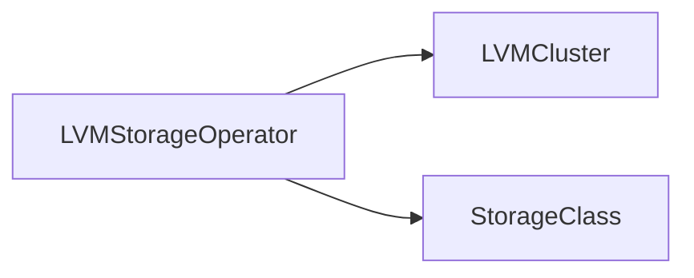

# Logical Volume Manager
Logical Volume Manager (LVM) is a software-based tool used for managing disk storage in Linux operating systems, including RHEL. LVM works by abstracting physical storage devices, such as hard disk drives or solid-state drives, into logical volumes that can be resized, moved, and backed up without disrupting the operation of the system.

In RHEL, LVM is implemented as a set of kernel modules that provide support for logical volumes. When LVM is installed, it creates a new layer of abstraction between physical storage devices and the file system. This layer is composed of three main components: physical volumes (PVs), volume groups (VGs), and logical volumes (LVs).

Physical volumes (PV) are storage devices that are managed by LVM. They can be disks, partitions, or even entire storage arrays. When a physical volume is initialized by LVM, it is divided into a number of physical extents (PEs), which are small, fixed-size units of storage.

Volume groups (VG) are collections of one or more physical volumes that are grouped together by LVM. A volume group provides a pool of storage space that can be allocated to logical volumes as needed.

Logical volumes (LV) are virtual disks that are created within volume groups. A logical volume is composed of one or more physical extents, which can be allocated from one or more physical volumes. Logical volumes can be resized dynamically, which means that administrators can add or remove storage capacity without having to shut down or restart the system.

LVM in RHEL provides several advantages over traditional partition-based storage systems. First, LVM allows administrators to allocate storage space more efficiently, by allowing logical volumes to span multiple physical volumes. Second, LVM provides greater flexibility in managing storage resources, by allowing logical volumes to be resized on-the-fly without disrupting the system. Finally, LVM provides enhanced reliability, by providing built-in support for backups and snapshots of logical volumes.

LVM is a powerful tool for managing disk storage in RHEL, providing flexibility, scalability, and reliability to meet the storage needs of modern enterprise applications.

[Source](https://access.redhat.com/documentation/en-us/red_hat_enterprise_linux/7/html/logical_volume_manager_administration/lvm_definition)

# About The LVM Storage Operator

In Openshift, the LVM operator (LVMS) provides a way to manage and automate the creation, deletion, resizing, and backup of logical volumes in an Openshift cluster.

Some of the key features of the LVM operator include:

- Automation: The Local Volume Manager Storage (LVMS) operator automates the process of creating and managing logical volumes, reducing the need for manual intervention and making it easier to scale storage resources in an Openshift cluster.

- Dynamic resizing: The LVMS operator enables dynamic resizing of logical volumes, which means that administrators can easily add or remove storage capacity as needed without having to shut down or restart applications.

- Backup and recovery: The LVMS operator includes built-in backup and recovery capabilities, which means that administrators can easily create and restore backups of logical volumes in the event of data loss or corruption.

- Integration with other Openshift components: The LVM operator is designed to work seamlessly with other components of the Openshift platform, such as persistent volumes and storage classes, to provide a comprehensive storage management solution.

- Customization: The LVMS operator can be customized to meet specific storage requirements, allowing administrators to define policies and rules for logical volume creation and management.

Overall, the LVMS operator is a powerful tool for managing storage resources in an Openshift cluster, providing automation, scalability, and flexibility to meet the needs of modern containerized applications.

# Limitations of the LVM Operator
- The LVMS is only supported in single node Openshift clusters deployed by Red Hat Advanced Cluster Management (RHACM).
- You can only create a single instance of the LVMCluster custom resource (CR) on an OpenShift Container Platform cluster.
- You can make only a single deviceClass entry in the LVMCluster CR.
- When a device becomes part of the LVMCluster CR, it cannot be removed.
- LVM Storage creates a volume group using all the available unused disks and creates a single thin pool with a size of 90% of the volume group. The remaining 10% of the volume group is left free to enable data recovery by expanding the thin pool when required.
- LVM Storage configures a default overprovisioning limit of 10 to take advantage of the thin-provisioning feature. The total size of the volumes and volume snapshots that can be created on the single-node OpenShift clusters is 10 times the size of the thin pool.

[Source](https://docs.openshift.com/container-platform/4.12/storage/persistent_storage/persistent_storage_local/persistent-storage-using-lvms.html#lvms-preface-sno-ran_logical-volume-manager-storage)

# Installation of the LVMS Operator
You can install the LVMS Operator using either the [Web Console](https://docs.openshift.com/container-platform/4.12/storage/persistent_storage/persistent_storage_local/persistent-storage-using-lvms.html#lvms-installing-lvms-with-web-console_logical-volume-manager-storage)  or via [RHACM](https://docs.openshift.com/container-platform/4.12/storage/persistent_storage/persistent_storage_local/persistent-storage-using-lvms.html#lvms-installing-odf-logical-volume-manager-operator-using-rhacm_logical-volume-manager-storage).

# The LVMCluster custom resource
The `LVMCluster` custom resource is a Kubernetes custom resource that is used in the LVMS Operator on OpenShift. The LVMCluster custom resource is used to create a Logical Volume Manager (LVM) cluster after LVM Storage is installed on OpenShift Container Platform.

Here are the steps to create an LVMCluster custom resource:

    1. Ensure that the Project selected is `openshift-storage`.
    2. In the OpenShift Container Platform Web Console, click `Operators` → `Installed Operators` to view all the installed Operators.
    3. Click on `LVM Storage`, and then click `Create LVMCluster` under `LVMCluster`.
    4. In the `Create LVMCluster` page, select either `Form view` or `YAML view`.
    5. In the `YAML view`, specify the LVMCluster custom resource definition with the required fields such as name, deviceClasses, thinPoolConfig, and nodeSelector.

[Source](https://docs.openshift.com/container-platform/4.12/storage/persistent_storage/persistent_storage_local/persistent-storage-using-lvms.html#lvms-creating-lvms-cluster_logical-volume-manager-storage)

The LVMCluster custom resource has the following fields:

    - `name`: The name of the LVMCluster custom resource.
    - `deviceClasses`: A list of device classes that define the storage devices to use in the LVM cluster.
    - `thinPoolConfig`: The configuration for the thin pool that will be created in the LVM cluster.
    - `nodeSelector`: A node selector that matches the worker nodes to use in the LVM cluster.

The LVMCluster custom resource also has some optional fields:

    - `tolerations`: A list of node tolerations to apply to the LVMCluster custom resource.
    - `deviceSelector`: A device selector that selects the storage devices to use in the LVM cluster. If this field is not included during the LVMCluster creation, it is not possible to add the deviceSelector section to the CR. In this case, the LVMCluster needs to be removed and a new CR needs to be created.


# Mount flow of operations for LVM Storage
```mermaid
graph TD
  A[Start] --> B{Is PV mounted?}
  B --> |Yes| C[Unmount PV]
  C --> D[Check if VG exists]
  D --> |Yes| E[Mount PV]
  E --> F[Check if LV exists]
  F --> |Yes| G[Mount LV]
  G --> H[Check if FS is formatted]
  H --> |No| I[Format FS]
  H --> |Yes| J[Mount FS]
  B --> |No| K[Check if VG exists]
  K --> |No| L[Create VG]
  L --> M[Create PV]
  M --> N[Create VG]
  N --> C
  I --> J
  ```
- A: The flowchart starts with a "Start" node.
- B: The first decision point in the flowchart is to check if the PV is already mounted. If the PV is mounted, the flowchart proceeds to the "Unmount PV" node (C) to safely unmount the PV before continuing. If the PV is not mounted, the flowchart proceeds to the next step. Checking if a PV is mounted can be done using the kubectl get pv command. If the PV was initially mounted and had to be unmounted, the flowchart loops back to the "Is PV mounted?" decision point (B) to continue with the mounting process. If the PV was not initially mounted, the flowchart ends at the "Mount FS" node (J) after all steps have been completed.
- C: Unmounting a PV can be done using the kubectl delete pv <pv-name> command.
- D: After unmounting the PV (if necessary), the next step is to check if the volume group (VG) associated with the PV exists. If the VG exists, the flowchart proceeds to the next step (E). If the VG does not exist, the flowchart proceeds to create a new VG (L) and continue from there.. Checking if a VG exists can be done using the `sudo vgdisplay <vg-name>` command.
- E: If the VG exists, the next step is to mount the PV to the VG. Mounting a PV can be done using the `sudo mount /dev/<vg-name>/<lv-name> <mount-point>` command.
- F: After the PV is mounted, the flowchart checks if a logical volume (LV) associated with the PV exists. If the LV exists, the flowchart proceeds to the next step (G). If the LV does not exist, the flowchart proceeds to create a new LV before continuing. Checking if an LV exists can be done using the `sudo lvdisplay <vg-name>/<lv-name>` command.
- G: If the LV exists, the next step is to mount the LV. Mounting an LV can be done using the `sudo mount /dev/<vg-name>/<lv-name> <mount-point>` command.
- H: After the LV is mounted, the flowchart checks if a file system (FS) is formatted on the LV. If the FS is not formatted, the flowchart proceeds to format the FS (I). If the FS is already formatted, the flowchart proceeds to mount the FS (J). Checking if an FS is formatted can be done using the `sudo file -s /dev/<vg-name>/<lv-name>` command. Formatting an FS can be done using a command such as `sudo mkfs.ext4 /dev/<vg-name>/<lv-name>`.
- K: Checking if a VG exists can be done using the `sudo vgdisplay <vg-name>` command.
- L: Creating a VG can be done using the `sudo vgcreate <vg-name> /dev/<device-name>` command, where <device-name> is the name of the device that will be used for the VG.
- M: Creating a PV can be done using the `kubectl apply -f <pv-manifest.yaml>` command, where <pv-manifest.yaml> is the name of the YAML file containing the PV configuration.
- N: Creating a VG can be done using the `sudo vgcreate <vg-name> /dev/<device-name>` command, where <device-name> is the name of the device that will be used for the VG. This step is repeated here because it is necessary to create the VG before creating the PV.
Note that the specific commands and syntax may vary depending on the OS and version being used.
  
# Unmount flow of operations for LVM Storage
  ```mermaid
  graph TD
  A[Start] --> B{Is PV mounted?}
  B --> |No| C[Exit]
  B --> |Yes| D[Unmount FS]
  D --> E[Unmount LV]
  E --> F[Unmount VG]
  F --> G[Delete PV]
  G --> H[Delete VG]
  H --> A
  ```
- A: The flowchart starts with a "Start" node.
- B: The first decision point in the flowchart is to check if the PV is mounted. If the PV is not mounted, the flowchart proceeds to the "Exit" node (C) and the process is terminated. If the PV is mounted, the flowchart proceeds to the next step.
- D: If the PV is mounted, the first step is to unmount the file system (FS) using the appropriate command. This step is necessary because the file system may be actively being used and cannot be deleted while mounted.
- E: After the FS is unmounted, the next step is to unmount the logical volume (LV) associated with the PV. This step is necessary because the LV may have been created to span multiple disks and the PV may only be one of the disks.
- F: Once the LV is unmounted, the next step is to unmount the volume group (VG) associated with the LV. This step is necessary because the VG may contain multiple LVs and the LV being deleted may only be one of them.
- G: After the VG is unmounted, the next step is to delete the PV associated with the VG. This step is necessary to remove the association between the VG and the physical disk(s) used by the PV.
- H: Finally, once the PV is deleted, the VG can be safely deleted as well.
- A: The flowchart loops back to the "Start" node, indicating that the process can be repeated for other PVs if necessary.
