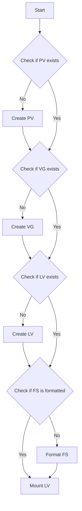

# Mount flow of operations for LVM Storage

- The flowchart starts with a "Start" node.
- The first decision point in the flowchart is to check if the PV exists. If the PV exists, continue to check whether the VG exists. If the PV does not exist, create a new PV using the device.
```bash
# pvcreate /dev/<device>
```
- The second decision point in the flowchart is to check if the VG exists. If the VG exists, continue to check whether the LV exxists. If the VG does not exist, create a new VG using the previous PV(s).
```bash
# vgcreate <vgname> /dev/<device>
```
- The third decision point in the flowchart is to check if the LV exists. If the LV exists, continue to check whether a FS exists. If the LV does not exist, create a new LV using the previously created VG. 
```bash
# lvcreate -n <lvname> <vgname>
```
- The fourth decision point in the flowchart is to check whether a FS exists on the LV. If a FS exists, continue to mounting the LV to a path. If a FS does not exist, create one on the LV. 
```bash
# mount /dev/<vgname>/<lvname> /mnt
```
Note that the specific commands and syntax may vary depending on the OS and version being used.
  
# Unmount flow of operations for LVM Storage
  ```mermaid
  graph TD
  A[Start] --> B{Is LV mounted?}
  B --> |No| C[Exit]
  B --> |Yes| D[Unmount FS]
  D --> E[Unmount LV]
  ```
- The flowchart starts with a "Start" node.
- The only decision point in the flowchart is checking whether the LV is mounted. If the LV is not mounted, exit. If the LV is mounted continue to unmount the FS -> LV. 
